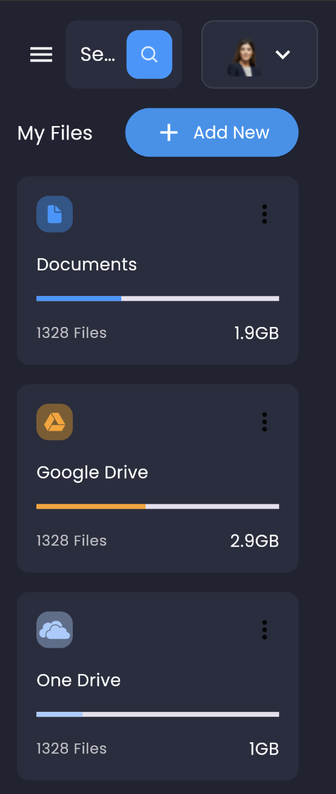

# Responsive and Adaptive Layouts in Flutter

## Introduction

Welcome to the Responsive and Adaptive Layouts project in Flutter! This project focuses on implementing responsive and adaptive design principles within Flutter applications to ensure optimal user experience across various devices.

## Getting Started

If you're new to Flutter development, don't worry! We've got you covered with some resources to kickstart your journey:

- **Lab:** Write your first Flutter app - This interactive codelab will guide you through creating your first Flutter application, perfect for beginners. [Start here](https://docs.flutter.dev/get-started/codelab).
- **Cookbook:** Useful Flutter samples - Explore a collection of practical Flutter samples covering a wide range of topics, including layout design, networking, and state management. [Check it out](https://docs.flutter.dev/cookbook).

For comprehensive guidance on Flutter development, make sure to refer to the [online documentation](https://docs.flutter.dev/). Here, you'll find tutorials, samples, and the complete API reference.

## Features

- Responsive layout design for various screen sizes, ensuring optimal user experience across devices.
- Adaptive UI components that adjust dynamically based on factors such as screen size, orientation, and device capabilities.
- Utilization of Flutter's powerful layout widgets and MediaQuery to create flexible and scalable UIs.
- Best practices for handling different form factors, including smartphones, tablets, and desktops.

## Usage

To incorporate responsive and adaptive layouts into your Flutter project:

1. Clone or download this repository.
2. Explore the implementation of responsive and adaptive design within the provided Flutter application.
3. Integrate relevant strategies and techniques into your own Flutter projects to enhance their usability and accessibility across different devices.

## Demo Screenshots

<!-- Add screenshots of your responsive and adaptive layouts here -->

## Contributing

Contributions to this project are welcome! If you have suggestions, improvements, or new features to propose, feel free to submit a pull request. Together, let's make Flutter development more responsive and adaptive for everyone.

## License

This project is licensed under the [MIT License](LICENSE).
